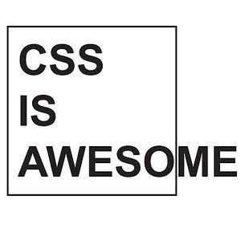

**aweCSSome** is a new breed CSS framework build on the edge of modern web standards.

       

---

**CAUTION! IT'S UNDER HEAVY DEVELOPMENT CURRENTLY! DON'T USE IT IN PRODUCTION!**

---

## Contents

1. [Description](#Description)
2. [Installation](#Installation)
2. [Usage](#Usage)
3. [Browser support](#Browser-support)
4. [Key concepts](#Key-concepts)
4. [Contributing](#Contributing)

## Description

aweCSSome is ready to use out of the box because it's written on vanilla CSS and doesn't require building. The main advantages are:

- flexible and predictable architecture based on [BEM methodology](https://en.bem.info/methodology);
- no need in overriding the framework code because there's no default theme provided;
- SEO-friendly HTML markup enriched by [microdata](https://schema.org);
- mobile-friendly by virtue of following of [Google recommendations](https://developers.google.com/search/mobile-sites) and using web standards capabilities;
- [WCAG 2.0](https://www.w3.org/TR/WCAG20) compliance HTML markup for developing inclusive web interfaces.

## Installation

Be careful aweCSSome is constantly in development! Try it out on your own risk.

### NPM

```sh
npm install awecssome
```

## Usage
After installation, you can link or import the CSS file into your project:

### HTML

```html
<link rel="stylesheet" href="/path/to/awecssome/awecssome.css" />
```

### CSS

```css
@import '/path/to/awecssome/awecssome.css';
```

### Via PostCSS and [postcss-import](https://github.com/postcss/postcss-import)

```sh
import 'awecssome';
```

### Via webpack and [css-loader](https://github.com/webpack-contrib/css-loader)

```sh
import 'awecssome';
```
### CDN

Coming soon!

## Browser support

aweCSSome is compatible with **2 recent** desktop versions of:

* Chrome
* Edge
* Firefox
* Opera
* Safari

and **2 recent** mobile versions of:

* Chrome
* Safari

We support only fresh browsers to keep our components' code clean and provide high performance.

The browserlist config is provided.

## Key concepts

aweCSSome is based on the next main principles:

1. [BEM methodology](#BEM-methodology)
2. [No default theme](#No-default-theme)
3. [Provided component modifiers](#Provided-component-modifiers)
4. [Mobile friendly](#Mobile-friendly)
5. [SEO friendly](#SEO-friendly)
6. [WCAG 2.0 compliance](#WCAG-2.0-compliance)

### BEM methodology

AweCSSome provides a set of common page components (breadcrumbs, cards, form elements etc.). Each component is logically and functionally independent [block](https://en.bem.info/methodology/key-concepts/#block). Blocks allow for their re-use, as well as facilitating the project development and support process. Read more about blocks in official BEM [documentation](https://en.bem.info/methodology/key-concepts/#block-features).

AweCSSome follows BEM naming convention with the [classic naming scheme](https://en.bem.info/methodology/naming-convention/#naming-rules), where the name of an entity is unique. The same BEM entity always has the same name in all technologies (CSS, JavaScript, HTML etc.). 

AweCSSome follows an alternative file structure approach to organizing the framework's file system. It's [nested](https://en.bem.info/methodology/filestructure/#nested) on the root level and [flat](https://en.bem.info/methodology/filestructure/#flat) on the component level.

**Example**

```sh
project
    common.blocks/
        input/                                # Directory for the input block 
            input_type_search.css             # CSS implementation of the input_type modifier 
            input__clear_visible.css          # CSS implementation of the input__clear_visible modifier 
            input__clear.css                  # CSS implementation of the input__clear element 
            input__clear.js                   # JavaScript implementation of the input__clear element 
            input.css                         # CSS implementation of the input block 
            input.js                          # JavaScript implementation of the input block 
```

### No default theme

AweCSSome doesn't have a default theme for page components. Component's CSS code represents only their composition, not the appearance. So there's no need for a developer to override the framework code. Just write (extend) your own code (add new properties) next to the component's code following BEM's redefinition levels [rules](https://en.bem.info/methodology/redefinition-levels).

**Example**

```sh
project/
    common.blocks/       # redefinition level with framework's blocks 
        breadcrumbs/     # breadcrumbs block composition styles
    project.blocks/      # redefinition level with project blocks 
        breadcrumbs/     # breadcrumbs block project appereance styles
```

Just remember aweCSSome doesn't impose design decisions that you have to fight to undo!

All components have base variables (CSS Custom properties) for building typography and color schemes (not fully implemented yet).

### Provided component modifiers

Each component has his own set of predefined [modifiers](https://en.bem.info/methodology/block-modification/#using-a-modifier-to-change-a-block). The modifiers represent specific instances of the component. Use them to change an instance without affecting surrounding blocks.

**Example**

```css
.product-card               /* default instans of a component */
.product-card_landscape     /* landsape orientation instans of a component */
```

You can add any number of modifiers to a block. Besides you can add your custom modifiers by redefinition levels. As a result, rules from all redefinition levels should be compiled by your build script (or linked to the page manually in the right order) and applied to the component.

### Mobile friendly

Following actual global trends, aweCSSome framework was built based on mobile first approach. 

Each component provides best practices for dealing with content images on different screen resolutions and image formats.

**Example**

```html
<picture>
    <source 
        src="product.webp"
        srcset="product.webp 350w, product.webp 650w" 
        sizes="(max-width: 600px) 300px, (min-width: 600px) 600px"
        alt="Product name">
    
</picture>
```

### SEO friendly

HTML markup of all components was developed based on semantic of HTML5 tags. It gives a lot of benefits besides SEO. In addition to semantic markup aweCSSome components are enriched by structured metadata using [microdata](https://schema.org/docs/gs.html) for common cases (product cards, reviews etc.).

These efforts lead to successful project indexing by search engines and enhance website "snippet" by making it "rich", or a short piece of quoted text shown when the page appears in [search listings](https://developers.google.com/search/docs/guides/mark-up-content).

### WCAG 2.0 compliance

SEO appropriate HTML markup semantics of aweCSSome components improves the accessibility of the user interface.

Accessibility of components is improved by following [WAI-ARIA Authoring Practices 1.1](https://www.w3.org/TR/wai-aria-practices). All of the components will be polished to be [WCAG 2.0](https://www.w3.org/TR/WCAG20) compliant.

## Contributing

If you're interested in the improvement of this project you can help in the following ways:

- bug reporting and new feature requesting by creating issues on plugin [GitHub page](https://github.com/lovata/aweCSSome/issues);
- contribution to a project following these [instructions](https://github.com/lovata/aweCSSome/blob/master/CONTRIBUTING.md).
